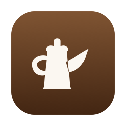
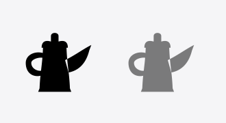
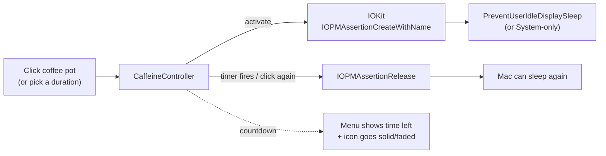

<div align="center">



# CoffeePot

**A tiny macOS menu-bar app that keeps your Mac awake.**

A coffee pot lives in your menu bar. Click it to keep your Mac (and display)
from sleeping for **15 minutes**, **60 minutes**, or **indefinitely**.

</div>

## States

The pot is **solid** while it's keeping your Mac awake and **faded** when idle.
It's a template icon, so it adapts to light and dark menu bars automatically.

| Light menu bar | Dark menu bar |
| --- | --- |
|  |  |

*(left: awake, right: idle)*

## Features

- ☕️ **One-click toggle**: left-click the pot to start/stop with your last
  chosen duration.
- ⏱️ **Durations**: 15 min, 60 min, or indefinite, from the right-click menu.
- ⏳ **Live countdown**: the menu shows how much time is left.
- 🖥️ **Display sleep control**: optionally let the display sleep while still
  preventing system idle sleep.
- 🚀 **Start at Login**: register as a login item (macOS 13+ `SMAppService`).
- 🧹 **No leftovers**: uses an IOKit power assertion, released automatically if
  the app ever quits or crashes. No lingering `caffeinate` process.
- 🪶 **Tiny and native**: pure Swift + AppKit, no dependencies, universal binary
  (Apple Silicon + Intel). Runs as an accessory (no Dock icon, no window).

## How it works



The keep-awake is a single power-management assertion held by the running
process. macOS releases it automatically when the process exits, so there is no
risk of leaving your Mac awake forever after a crash.

## Install

Requires the Xcode **Command Line Tools** (`xcode-select --install`). No full
Xcode or Swift Package Manager needed.

```bash
git clone https://github.com/manuelfedele/coffeepot.git
cd coffeepot
./install.sh        # builds, signs (ad-hoc), copies to /Applications, launches
```

To build without installing:

```bash
./build.sh          # produces build/CoffeePot.app
open build/CoffeePot.app
```

### Start at Login

Open the right-click menu and toggle **Start at Login**. (This sticks once the
app is installed in `/Applications`.)

## Usage

| Action | Result |
| --- | --- |
| **Left-click** the pot | Toggle keep-awake on/off with the last duration |
| **Right-click** the pot | Open the menu: durations, options, quit |
| Pick *15 / 60 / indefinite* | Start keeping awake for that period |
| *Allow display to sleep* | Keep the system awake but let the screen sleep |
| *Quit* | Release the assertion and exit |

## Project layout

```
Sources/CoffeePot/
  main.swift              # entry point (accessory app)
  AppDelegate.swift       # status item, menu, UI wiring
  CaffeineController.swift # IOKit power assertion + countdown timer
  LoginItem.swift         # Start-at-Login via SMAppService
  StatusIcon.swift        # the coffee-pot icon (CoreGraphics)
Tools/
  GenerateAppIcon.swift   # renders AppIcon.icns from the same geometry
Info.plist                # LSUIElement accessory app
build.sh / install.sh     # build + install (no Xcode project)
```

## License

MIT © 2026 Manuel Fedele. See [LICENSE](LICENSE).
